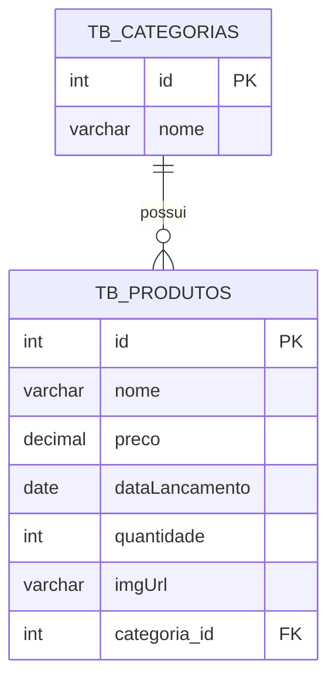

# 🎮 Loja de Games API — Back-End E-commerce


---

## 🔗 Acesso e Ambiente da API

* **Ambiente de Desenvolvimento:** `http://localhost:3000`
* **Base de Dados:** MySQL (`db_loja_games`)
* **Prefixo das Rotas:** `/categorias` e `/produtos`

---

## 📖 Visão Geral

A **Loja de Games API** é uma solução de back-end desenvolvida com o framework **NestJS 11**, **TypeScript** e **TypeORM**, modelada para alimentar um catálogo comercial de e-commerce voltado a jogos digitais.

Criado no contexto prático do bootcamp **Generation Brasil (Turma JS13)**, o projeto adota os princípios de arquitetura modular, injeção de dependências e separação estrita de responsabilidades entre Controladores, Serviços e Entidades. A API gerencia o ciclo completo de categorias e produtos, estabelece relacionamento relacional 1:N com validação cruzada entre serviços e disponibiliza filtros de busca por faixas de preço.

---

## ✨ Funcionalidades

* 📂 **Gestão de Categorias (`/categorias`):**
  * Cadastro de categorias temáticas de games (ex: RPG, Ação, Estratégia).
  * Listagem geral de categorias trazendo seus respectivos produtos associados.
  * Busca individual por ID com tratamento específico para registros inexistentes (HTTP 404).
  * Atualização e exclusão com cascata relacional.
* 🕹️ **Gestão de Produtos / Games (`/produtos`):**
  * Cadastro de jogos exigindo vínculo obrigatório com uma categoria prévia válida.
  * Listagem completa trazendo o relacionamento da categoria anexado.
  * Busca por ID de produto.
  * Atualização de dados cadastrais (nome, preço, data de lançamento, estoque e capa).
  * Exclusão de itens do catálogo com status `HTTP 204 No Content`.
* 🔍 **Filtros Avançados de Preço:**
  * `GET /produtos/preco-maior-que/:value`: Retorna jogos com valor acima do parâmetro, ordenados de forma crescente (`ASC`).
  * `GET /produtos/preco-menor-que/:value`: Retorna jogos com valor abaixo do parâmetro, ordenados de forma decrescente (`DESC`).
* 🛡️ **Validação Global de Dados:** Aplicação de `ValidationPipe` do NestJS sanitizando e validando tipos, limites de caracteres e restrições de negócio em tempo de execução.

---

## 🎯 Diferenciais e Destaques Técnicos

1. **Validação Cruzada entre Serviços Independentes:** No momento da criação ou atualização de um produto, o `ProdutoService` aciona o `CategoriaService.findById(...)` para assegurar que o ID de categoria informado existe no banco antes de autorizar a persistência.
2. **NumericTransformer Customizado:** Mapeamento bidirecional anexado à coluna decimal de preço (`decimal(6,2)`), convertendo a string retornada pelo driver MySQL em valor numérico nativo (`number/float`) do JavaScript para evitar erros de cálculo financeiro.
3. **Pipes e Sanitização Automática:** Utilização de `ParseIntPipe` em rotas com parâmetros de URL (`:id`, `:value`), garantindo coerção de tipo estrita e rejeição imediata de entradas não numéricas.
4. **Arquitetura Modular Desacoplada:** Exportação explícita de `CategoriaService` dentro do `CategoriaModule` para consumo seguro no `ProdutoModule`.

---

## 🏗️ Arquitetura e Estrutura de Pastas

```text
src/
├── app.controller.ts            # Controlador raiz de integridade (Healthcheck)
├── app.module.ts                # Módulo central com configuração TypeORM / MySQL
├── app.service.ts               # Serviço base
├── main.ts                      # Ponto de entrada com ValidationPipe global
├── categoria/                   # Módulo de Categorias
│   ├── categoria.module.ts      # Definição e exportação de serviços
│   ├── controller/
│   │   └── categoria.controller.ts # Rotas HTTP (/categorias)
│   ├── entity/
│   │   └── categoria.entity.ts     # Entidade tb_categorias
│   └── service/
│       └── categoria.service.ts    # Regras de negócio e persistência de categorias
├── produto/                     # Módulo de Produtos
│   ├── produto.module.ts        # Importa CategoriaModule e registra repositório
│   ├── controller/
│   │   └── produto.controller.ts   # Rotas HTTP (/produtos e filtros de preço)
│   ├── entity/
│   │   └── produto.entity.ts       # Entidade tb_produtos
│   └── service/
│       └── produto.service.ts      # Regras de negócio e consultas TypeORM
└── util/
    └── NumericTransformer.ts    # Transformador de tipos monetários SQL <-> JS
```

---

## 🎲 Modelagem do Banco de Dados (DER)

A estrutura relacional mapeia o vínculo de integridade entre as categorias e os jogos:



---

## 📋 Tabela de Endpoints

### 1. Categorias (`/categorias`)

| Método | Rota | Descrição | Status Sucesso |
| :--- | :--- | :--- | :--- |
| `GET` | `/categorias` | Lista todas as categorias com seus jogos | `200 OK` |
| `GET` | `/categorias/:id` | Consulta categoria por ID | `200 OK` |
| `POST` | `/categorias` | Cadastra uma nova categoria | `201 Created` |
| `PUT` | `/categorias` | Atualiza os dados de uma categoria | `200 OK` |
| `DELETE` | `/categorias/:id` | Exclui a categoria e seus vínculos | `204 No Content` |

### 2. Produtos (`/produtos`)

| Método | Rota | Descrição | Status Sucesso |
| :--- | :--- | :--- | :--- |
| `GET` | `/produtos` | Lista todos os jogos cadastrados | `200 OK` |
| `GET` | `/produtos/:id` | Consulta jogo por ID | `200 OK` |
| `POST` | `/produtos` | Cadastra um novo jogo com categoria válida | `201 Created` |
| `PUT` | `/produtos` | Atualiza informações de um jogo | `200 OK` |
| `DELETE` | `/produtos/:id` | Exclui o jogo do catálogo | `204 No Content` |
| `GET` | `/produtos/preco-maior-que/:value` | Filtra jogos com preço maior que o valor (`ASC`) | `200 OK` |
| `GET` | `/produtos/preco-menor-que/:value` | Filtra jogos com preço menor que o valor (`DESC`) | `200 OK` |

---

## 📋 Validações e Regras de Negócio

* **Validação de Nomes:** Nomes de categorias e produtos exigem entre **4 e 60 caracteres** (`@Length(4, 60)`), sem espaços ociosos nas bordas (`@Transform(trim)`).
* **Validação de Preço:** Campo monetário com precisão de até 2 casas decimais e valor mínimo não negativo (`@Min(0)`).
* **Validação de URL de Capa:** A propriedade `imgUrl` valida opcionalmente o formato de URL válido (`@IsUrl()`).
* **Vínculo Obrigatório:** Não é permitido salvar um jogo sem um objeto de categoria válido contendo seu ID.
* **Integridade Relacional:** A exclusão de uma categoria propaga deleção em cascata (`onDelete: 'CASCADE'`) para os produtos dependentes.

---

## ⚙️ Requisitos e Instalação

### Pré-requisitos
* **Node.js:** Versão 18 ou superior.
* **Banco de Dados MySQL:** Instância ativa na porta 3306 (local ou container).
* **Gerenciador de Pacotes:** `npm`.

### 1. Clonar o Repositório
```bash
git clone https://github.com/erickystn/generation_JS13_Projeto_Loja_Games.git
cd generation_JS13_Projeto_Loja_Games
```

### 2. Instalar as Dependências
```bash
npm install
```

### 3. Configurar a Base de Dados
Crie a base de dados no MySQL:
```sql
CREATE DATABASE db_loja_games;
```

Ajuste as credenciais de acesso em `src/app.module.ts` conforme o seu ambiente:
```typescript
TypeOrmModule.forRoot({
  type: 'mysql',
  host: 'localhost',
  port: 3306,
  username: 'root',
  password: 'sua_senha_mysql',
  database: 'db_loja_games',
  synchronize: true, // Cria e sincroniza as tabelas automaticamente
  autoLoadEntities: true,
})
```

---

## 🚀 Como Executar

```bash
# Modo de desenvolvimento com Hot Reload:
npm run start:dev

# Compilação do projeto para produção:
npm run build

# Execução em modo de produção:
npm run start:prod
```

O servidor inicializará por padrão em `http://localhost:3000`.

---

## 💻 Exemplos de Uso e Requisições

### 1. Cadastrar uma Categoria (`POST /categorias`)
```bash
curl -X POST http://localhost:3000/categorias \
  -H "Content-Type: application/json" \
  -d '{
    "nome": "RPG de Ação"
  }'
```

**Resposta (201 Created):**
```json
{
  "id": 1,
  "nome": "RPG de Ação"
}
```

---

### 2. Cadastrar um Jogo (`POST /produtos`)
```bash
curl -X POST http://localhost:3000/produtos \
  -H "Content-Type: application/json" \
  -d '{
    "nome": "Elden Ring",
    "preco": 249.90,
    "dataLancamento": "2022-02-25",
    "quantidade": 15,
    "imgUrl": "https://exemplo.com/elden-ring.jpg",
    "categoria": {
      "id": 1
    }
  }'
```

**Resposta (201 Created):**
```json
{
  "id": 1,
  "nome": "Elden Ring",
  "preco": 249.90,
  "dataLancamento": "2022-02-25",
  "quantidade": 15,
  "imgUrl": "https://exemplo.com/elden-ring.jpg",
  "categoria": {
    "id": 1
  }
}
```

---

### 3. Filtrar Jogos por Faixa de Preço (`GET /produtos/preco-maior-que/150`)
```bash
curl -X GET http://localhost:3000/produtos/preco-maior-que/150
```

---

## 🧪 Suíte de Testes

```bash
# Testes unitários com Jest
npm run test

# Testes end-to-end (e2e)
npm run test:e2e
```

---

## 🛠️ Tecnologias Utilizadas

| Tecnologia | Versão | Finalidade |
| :--- | :--- | :--- |
| **NestJS** | 11.0 | Framework corporativo progressivo para Node.js |
| **TypeScript** | 5.7 | Superset com tipagem estática e decorators |
| **TypeORM** | 0.3 | Object-Relational Mapper (ORM) |
| **MySQL2** | 3.19 | Driver de comunicação com o MySQL |
| **Class Validator** | 0.15 | Validação declarativa por anotações em DTOs e entidades |
| **Class Transformer**| 0.5 | Transformação e sanitização de payloads |
| **Jest & Supertest** | 30.0 | Suíte e biblioteca de testes automatizados |

---

## 📈 Melhorias e Próximos Passos (Roadmap)

- [ ] Implementação de camada de segurança com **JWT** e controle de perfis de usuário (`security-layer`).
- [ ] Documentação interativa de endpoints com **Swagger / OpenAPI** (`@nestjs/swagger`).
- [ ] Upload de imagens de capa integrado a provedores de nuvem (Cloudinary / S3).
- [ ] Paginação de resultados na listagem de produtos.
- [ ] Containerização com `Dockerfile` e `docker-compose.yml`.

---

## 🤝 Como Contribuir

1. Faça um **Fork** do projeto.
2. Crie uma branch dedicada à sua feature:
   ```bash
   git checkout -b feature/nova-funcionalidade
   ```
3. Realize o commit com mensagens semânticas:
   ```bash
   git commit -m 'feat: adiciona paginacao na listagem de produtos'
   ```
4. Suba a branch para o seu fork:
   ```bash
   git push origin feature/nova-funcionalidade
   ```
5. Abra um **Pull Request**.

---

## 👤 Autor & 📄 Licença

Desenvolvido por **[Ericky Sant'ana](https://github.com/erickystn)** durante o bootcamp da **Generation Brasil**.

Distribuído sob a licença **MIT**.
